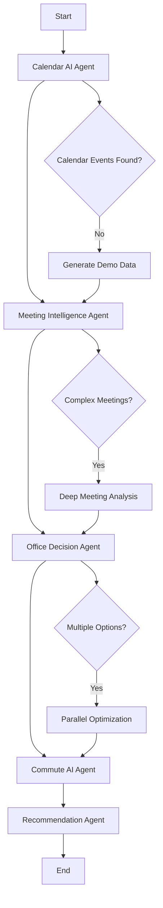

# LangGraph AI Agent Architecture

## Overview
Transform the rule-based commute planner into a true agentic AI system using LangGraph for orchestration, LangChain for tool integration, and LLMs for intelligent reasoning.

## LangGraph Workflow Design



## AI Agent Transformations

### 1. Calendar AI Agent (Schedule Analysis)
**Current**: Mock data retrieval
**AI Transformation**:
- **LLM**: GPT-4/Claude for event interpretation
- **Tools**: Real Google Calendar API, email parsing
- **Intelligence**: 
  - Extract meeting context from descriptions
  - Identify recurring patterns 
  - Understand meeting importance/urgency
  - Parse location hints and requirements

### 2. Meeting Intelligence Agent (Classification)
**Current**: Keyword matching rules
**AI Transformation**:
- **LLM**: Anthropic Claude for nuanced understanding
- **Tools**: Company directory, meeting history analysis
- **Intelligence**:
  - Semantic understanding of meeting content
  - Attendee relationship analysis
  - Meeting urgency and importance scoring
  - Cultural/company context awareness
  - Real-time adaptability to new meeting types

### 3. Office Decision Agent (Presence Validation)
**Current**: Hard 4-hour business rules
**AI Transformation**:
- **LLM**: GPT-4 for complex decision making
- **Tools**: Company policy knowledge base, weather API
- **Intelligence**:
  - Flexible business rule interpretation
  - Cost-benefit analysis of commute vs productivity
  - Team coordination optimization
  - Personal preference learning
  - Contextual exceptions (weather, traffic, personal events)

### 4. Commute AI Agent (Route Optimization)
**Current**: Static time calculations
**AI Transformation**:
- **LLM**: Claude for route reasoning
- **Tools**: Real Google Maps, traffic APIs, transit APIs
- **Intelligence**:
  - Multi-modal transport optimization
  - Real-time traffic prediction
  - Personal preferences and constraints
  - Environmental impact consideration
  - Alternative route creativity

### 5. Recommendation Agent (Presentation)
**Current**: Template formatting
**AI Transformation**:
- **LLM**: GPT-4 for personalized communication
- **Tools**: User preference history, notification APIs
- **Intelligence**:
  - Personalized explanation generation
  - Confidence scoring and reasoning
  - Risk assessment and mitigation
  - Learning from user feedback
  - Adaptive communication style

## LangGraph State Management

```python
class AICommuteState(BaseModel):
    # Core data
    user_id: str
    target_date: str
    calendar_events: List[Dict]
    
    # AI reasoning traces
    calendar_analysis: Dict[str, Any]
    meeting_intelligence: Dict[str, Any] 
    office_decision: Dict[str, Any]
    commute_optimization: Dict[str, Any]
    final_recommendation: Dict[str, Any]
    
    # LLM metadata
    llm_calls: List[Dict[str, Any]]
    confidence_scores: Dict[str, float]
    reasoning_chains: Dict[str, List[str]]
    
    # User feedback loop
    user_preferences: Dict[str, Any]
    historical_choices: List[Dict[str, Any]]
```

## Tool Integration Strategy

### LangChain Tools
1. **GoogleCalendarTool** - Real calendar API integration
2. **GoogleMapsTool** - Live traffic and routing
3. **WeatherTool** - Weather impact on commute decisions
4. **CompanyPolicyTool** - RAG-powered policy knowledge
5. **UserPreferenceTool** - Personalization database
6. **FeedbackTool** - Learning from user choices

### LLM Selection Strategy
- **Calendar Analysis**: Claude (excellent at text understanding)
- **Meeting Classification**: GPT-4 (strong reasoning capabilities)
- **Decision Making**: Claude (nuanced business logic)
- **Route Planning**: GPT-4 (mathematical optimization)
- **Communication**: Claude (natural, helpful tone)

## Implementation Phases

### Phase 1: Core LangGraph Setup
1. Install langchain, langgraph, openai, anthropic
2. Create LangGraph workflow definition
3. Set up state management
4. Basic LLM integration

### Phase 2: Agent Intelligence
1. Transform each agent to use LLMs
2. Add real tool integrations
3. Implement reasoning traces
4. Add confidence scoring

### Phase 3: Learning & Optimization  
1. User feedback collection
2. Preference learning
3. Performance optimization
4. A/B testing framework

## Key Benefits of AI Transformation

1. **Intelligent Understanding**: Semantic analysis vs keyword matching
2. **Adaptive Decision Making**: Context-aware vs rigid rules
3. **Personalization**: Learning user preferences over time
4. **Explainability**: Clear reasoning chains for decisions
5. **Flexibility**: Handle edge cases and new scenarios
6. **Continuous Improvement**: Learn from user feedback

## Technical Requirements

### Dependencies
```
langchain>=0.1.0
langgraph>=0.1.0
openai>=1.0.0
anthropic>=0.8.0
pydantic>=2.0.0
```

### Environment Variables
```
OPENAI_API_KEY=your_key_here
ANTHROPIC_API_KEY=your_key_here
GOOGLE_CALENDAR_API_KEY=your_key_here
GOOGLE_MAPS_API_KEY=your_key_here
```

### Infrastructure Changes
- Enhanced logging for LLM calls and reasoning
- Vector database for RAG (company policies, preferences)
- Model caching for performance
- Usage tracking and cost optimization